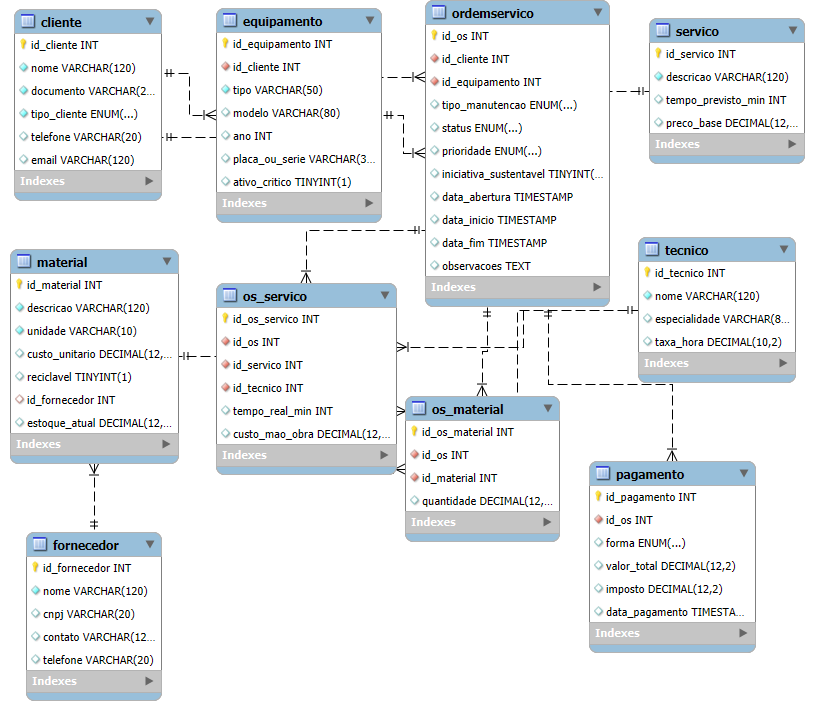

# 🛠️ Projeto Banco de Dados Oficina Mecânica

## 📖 Descrição
Este projeto implementa um **banco de dados relacional** para simular o funcionamento de uma **oficina mecânica**.  
O objetivo é gerenciar **clientes, veículos, ordens de serviço, técnicos, serviços, materiais e pagamentos**, além de permitir **consultas analíticas** que auxiliam na tomada de decisão.

O sistema foi modelado para oferecer:
- 📌 **Gestão de clientes**: cadastro de pessoas físicas e jurídicas (indústrias), permitindo análise de frotas e contratos corporativos.  
- 🛠️ **Controle operacional**: registro de ordens de serviço, serviços executados, técnicos responsáveis e materiais aplicados.  
- ⚠️ **Ativos críticos**: identificação de veículos/equipamentos essenciais para o cliente, priorizando sua manutenção.  
- 🔧 **Manutenção preventiva**: classificação das ordens de serviço em preventiva, corretiva ou emergencial, permitindo análises de confiabilidade.  
- 💰 **Gestão financeira**: acompanhamento de pagamentos, impostos e faturamento por cliente.  
- ♻️ **Sustentabilidade**: rastreamento de materiais recicláveis e cálculo do percentual de ordens sustentáveis.  

> ⚠️ Todos os dados são fictícios.  
> 🎯 O foco está em **boas práticas de modelagem** e **consultas SQL**, de forma clara e didática.

---

## 🏗️ Modelagem

O banco foi estruturado com as seguintes entidades principais:

- **Cliente** → Cadastro de clientes (PF ou PJ/indústria).  
- **Equipamento** → Veículos/equipamentos atendidos, com flag de **ativo crítico**.  
- **OrdemServico** → Ordens abertas, concluídas ou canceladas, com tipo de manutenção (preventiva, corretiva, emergencial).  
- **Servico** → Catálogo de serviços prestados (troca de óleo, revisão, alinhamento, etc.).  
- **Tecnico** → Técnicos especializados, com taxa/hora e especialidade.  
- **OS_Servico** → Relação N:N entre ordens de serviço e serviços executados, incluindo tempo real e custo de mão de obra.  
- **Material** → Peças e insumos utilizados, com campo `reciclavel`.  
- **OS_Material** → Relação N:N entre ordens de serviço e materiais aplicados.  
- **Pagamento** → Registro de pagamentos, impostos e formas de quitação.  

---

## 📖 Explicação do Modelo ER

- **Cliente → OrdemServico**: um cliente pode ter várias ordens, mas cada OS pertence a apenas um cliente.  
- **OrdemServico → OS_Servico → Servico**: relação N:N entre ordens e serviços.  
- **OrdemServico → OS_Material → Material**: cada OS pode utilizar vários materiais, inclusive recicláveis.  
- **OrdemServico → Pagamento**: cada ordem pode ter um ou mais registros de pagamento.  
- **Tecnico → OS_Servico**: técnicos são responsáveis pela execução dos serviços.  
- **Equipamento → OrdemServico**: cada OS está vinculada a um equipamento, que pode ser crítico.  

## 📊 Modelo EER

## 📊 Modelo EER


Esse modelo garante **normalização**, evita **redundâncias** e permite consultas analíticas sobre clientes, serviços, faturamento, sustentabilidade e confiabilidade de ativos.


---

## 🔮 Possíveis Extensões

- **Controle de estoque de materiais**: registrar entradas e saídas de peças.  
- **Histórico de manutenção por veículo**: rastrear todas as OS vinculadas a um equipamento.  
- **Relatórios de produtividade por técnico**: medir tempo médio e serviços executados.  
- **Indicadores de sustentabilidade**: percentual de materiais recicláveis utilizados.  
- **Integração com sistemas de agendamento**: marcação de serviços futuros.  

---

## 🚀 Como Executar

1. Criar o banco de dados:
   ```sql
   CREATE DATABASE oficina;
   USE oficina;

2. Executar os scripts de criação das tabelas.
3. Popular com os INSERTs fornecidos.
4. Rodar as queries analíticas para gerar insights.

📈 Exemplos de Consultas Analíticas

#  Total de imposto pago em todas as ordens?
# 1020.00 R$

```sql
SELECT sum(imposto) 
AS IMPOSTO_TOTAL
FROM pagamento;
```
# 11- Identificar os  5 serviços com maior tempo real de execução?
```sql
SELECT 
    s.descricao AS servico,
    t.nome AS tecnico,
    os.tempo_real_min,
    os.custo_mao_obra
FROM OS_Servico os
JOIN Servico s ON os.id_servico = s.id_servico
JOIN Tecnico t ON os.id_tecnico = t.id_tecnico
ORDER BY os.tempo_real_min DESC
LIMIT 5;
```

# 12- Calcular o percentual de ordens com iniciativa sustentável?

```sql
SELECT  iniciativa_sustentavel,
count(*) * 100 / sum(count(*)) over() as porcentagem
 from OrdemServico
group by iniciativa_sustentavel;
```


📝 Autor
Projeto desenvolvido por Victor Biscaia, como estudo de modelagem e análise de dados em SQL para oficina mecânica.
- 👤 Autor: Victor Biscaia
- 🎓 Uso: Projeto acadêmico para portfólio e prática de SQL/modelagem
- 📜 Licença: Livre uso educativo; adapte conforme necessidade do seu repositório

---


   